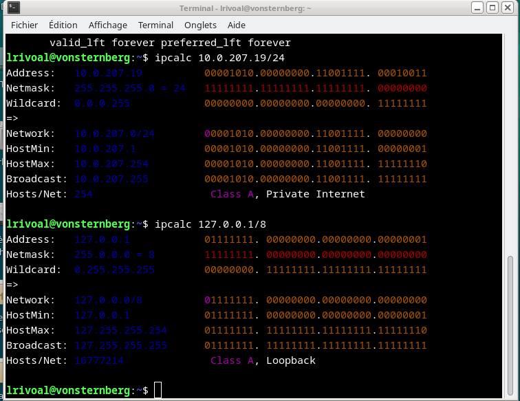
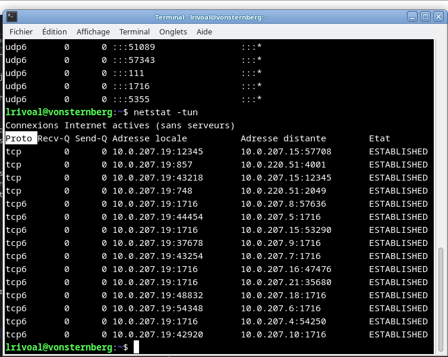

# 1: INTERFACES Réseau et adresse IP 

1) On peut voir dans l'interfaces eth0 on a comme IPv4 et IPv6 suivants:
 * 10.0.207.19
 * 2001:660:6101:800:207::19 

En revanche pour l'interface lo on a comme IPv4 et IPv6 les adresses suivantes:

*  127.0.0.1
*  ::1

2) Effectivement on peut voir avec la commande "ip adress ls" on a une version lisible et plus explicite des adresse IP de ces deux interfaces. 

3) Voici le resultat de la commande "$ ipcalc l_adresse_ip/la_taille_du_prefixe"
* Pour eth0 suivi de lo

 

 

* Pour commencer on peut observer que contrairement à eth0, le lo a pour particularité d'avoir la même adresse IP que le HOSTMIN. On peut donc en conclure que cette adresse corespond à celle de la machine sur laquelle je me situe.

4) Effectivement on peut observer que le MTU de ces deux interfaces ne sont pas les mêmes(9000 pour eth0 et 65536 pour lo)

* A noté que la dfférence entre les MTU des deux interfaces est du au fait que l'eth0 est l'interfaces réseau et lo pour l'interface locale

5) Voici l'application de la commande "ping" :

 

 

 

# 2 Netcat & Netstat

1) On peut voir ici que ce qui est surligner sur le terminal de gauche est le resultat de ma commande effectué sur mon autre terminal de commande.

 

Note:(grep est une commande qui représente l'équivalent du CRTL+F)

2) Voici quelques captures d'écran qui résultent des questions demandés de cette partie :

# 3 Protocole ARP

1) Voici une capture d'ecran de mes commandes réaliser afin de pouvoir visualiser les activités de machines voisines compris sur le même réseau.

2) On observera ici que l'adresse du routeur est bien compris ici:

3) Voilà ce que cela donne pour un cas ou la machine est déjà connecté

Voici à contrario ce que celà produit lorsque l'on parle d'une machine non connecté

 

On notera que si on reessaye de tapé /sbin/ifconfig dans le terminal alors là machine que l'on a essayé "d'appeler" est maintenant présent dans la liste mais étant donc incomplète.
 

4) Voici le résultat de la commande "ip neigh ls", on remarquera que je peux effectivement voici l'adresse de mon voisin en IPV6

5) Voilà ce que ça donne pour la commande ping -4 8.8.8.8 :

Voilà ce que celà donne pour 10.0.252.4 :

Ces deux adresses ne sont pas compris dans la liste des machine connectés car ce sont des "adresses privés"
### A VERIFIER!!!

# 4 RESOLUTION DE NOMS (DNS)

## Demander des éclaircicements au prof
****

# 5 Services au CREMI : LDAP & NFS

## A faire

*******

# TP 2

## 1 Configuration d'un réseau local

1) Voici le resultat de la première commande réaliser :
Avant d'avoir inséré le login

Après avoir inséré le login( login étant égale à : "root")

2) Voilà le résultat de la commande "ifconfig -a" dans les terminaux suivants:

On remarquera donc que les interfaces eth0 et lo. 

3) L'adresse du réseau est donc égal à 192.168.0.0 avec comme masque du réseau égal à 255.255.255.0. La plage de cette adresse IP de ce réseaux est donc de 254

4) Voici le résultat de cette commande "ifconfig eth0 192.168.0.1/24 up" sur les terminaux suivants:

5) On peut donc voir de par cette capture d'écran que la configurations sur nos 4 terminals c'est bien passée :

Le protocole de ping est en IPv4.

6) Voici ce qui ce passe lorsque je ping immortal depuis opeth:

7) Voilà ce qui arrive si je pinge une IP autre que celle configurer

On peut donc observer que la destination demandée est introuvable.

8) Voilà divers image que réprésentent l'activité demandées:

On observe donc que cela ne marche pas. J'essaye donc à présent de tester cela avec la commande donnée:

